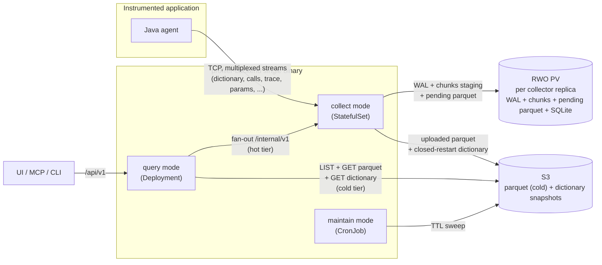
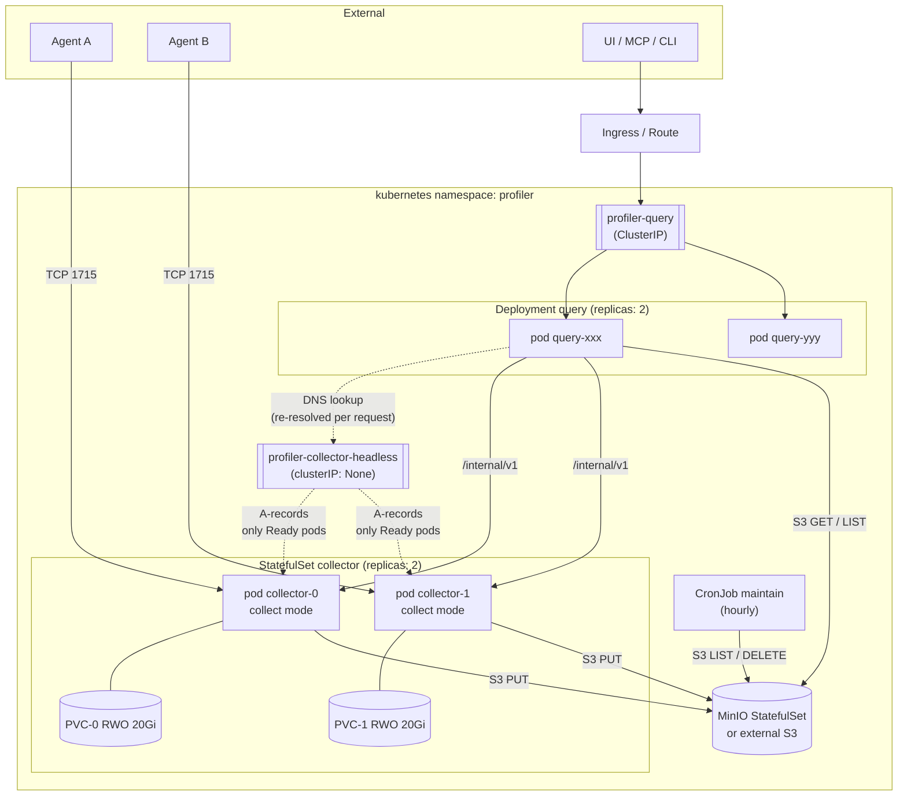
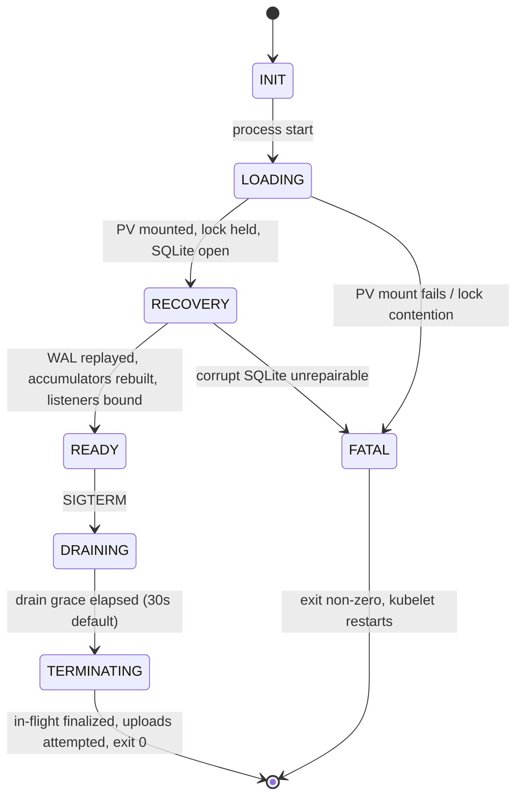
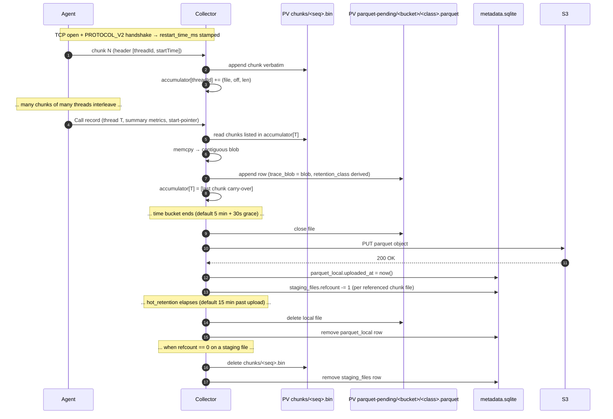
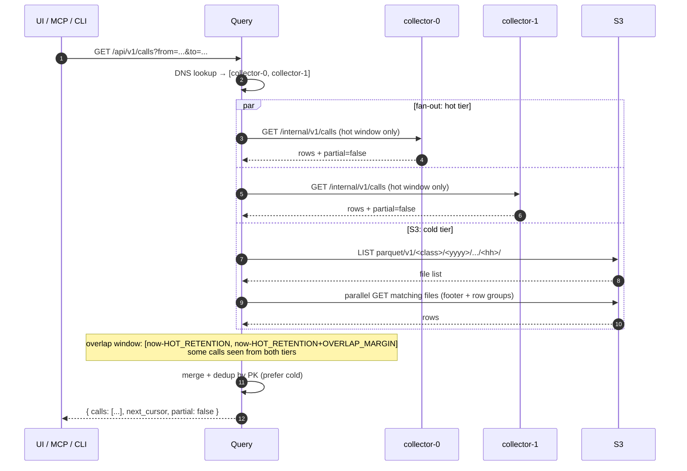

# 05 — Diagrams

> Status: **draft**, awaiting review. Mermaid-encoded visual summaries of the contracts in 01–04. The diagrams are derived views; if any disagrees with a contract document, the contract document wins.

## 1. Scope

Six diagrams covering the system end-to-end:

1. **Data flow** — agent stream → collector → S3 ↔ query → client.
2. **Deployment topology** — k8s workloads, services, storage.
3. **Collector state machine** — startup, recovery, shutdown.
4. **Per-call write-side lifecycle** — chunk arrival → per-call blob → parquet → S3.
5. **Hot/cold read flow** — query fan-out and merge.
6. **Pod-restart lifetime** — when each on-disk and S3 artifact appears and disappears.

Diagrams render in any Mermaid-aware viewer (GitHub, VS Code, Obsidian, mermaid.live).

## 2. Data flow (system-level)

**Key invariants visible here:**

- Agent → collector is the only ingestion path. There is no other writer of trace data.
- The PV holds only collector-private state (per `01-write-contract.md` §8). It is not shared between replicas.
- S3 is the cold-tier authoritative store. All other tiers can be reconstructed from it if needed (modulo the in-flight hot window).
- `maintain` never reads from PV — it operates only on S3 metadata + listings.

## 3. Deployment topology

**What this shows:**

- Stable pod identity per StatefulSet ordinal (`collector-0`, `collector-1`); each owns one PVC for life.
- The headless service is the discovery mechanism for `query`. Only `Ready` collector pods appear in DNS, so a recovering pod never gets hot reads.
- Agents pick a collector replica when they dial port 1715. There is no LB in front; sticky-per-TCP-connection is implicit.
- All three workloads talk to S3 directly. None go through each other for object access.

## 4. Collector state machine

**Readiness behaviour:**

- `INIT`, `LOADING`, `RECOVERY`, `DRAINING`, `TERMINATING`, `FATAL` → readiness probe `503`.
- `READY` → readiness probe `200`.
- Liveness probe returns `200` in all states except `FATAL` and process-level deadlock (which we don't have a separate diagram for; see `03-lifecycle.md` §4).

The asymmetry between liveness and readiness is deliberate: a slow recovery should not get the pod killed and reset — only kicked out of DNS until it stabilizes.

## 5. Per-call write-side lifecycle

**Visible in this diagram:**

- The collector never decodes individual events; only chunk headers (`01-write-contract.md` §4.2).
- Local parquet outlives the S3 upload by `hot_retention`, then is deleted (`01-write-contract.md` §6.3; `02-read-contract.md` §4.2).
- Chunks staging files outlive parquet upload until all sourced rows are committed to S3.
- `metadata.sqlite` is the single source of truth for refcounts and upload checkpoints; everything on the PV is rebuildable from it (and vice versa).

## 6. Hot/cold read flow

**Key behaviours visible:**

- Three parallel reads, all bounded by `PROFILER_FANOUT_TIMEOUT`. Partial failure → `partial: true`, not an error.
- Dedup is unconditional, even when sticky TCP "should" prevent dupes — protects against replica transitions, retries, and overlap window.
- Cold path uses S3 LIST per `<retentionClass>/<yyyy>/<mm>/<dd>/<hh>/` prefix; no manifest yet (`02-read-contract.md` §5.3).

## 7. Artifact lifetime reference

A Mermaid `gantt` doesn't render this well because the time scales span three orders of magnitude (minutes for live ingestion vs. days for S3 retention). Tabular form is clearer:

| Artifact | Storage | Created at | Removed at |
|---|---|---|---|
| Agent TCP connection | network | TCP accept | TCP close (agent crash, collector crash, collector shutdown) |
| Dictionary WAL | local PV | First dictionary chunk arrives | After S3 dictionary upload + 1 h grace |
| Chunks staging file | local PV | First chunk of new staging segment | When `refcount = 0` (every parquet row sourced from it uploaded to S3) |
| Open parquet writers | RAM | First Call record matches its `(timeBucket, retentionClass)` | Flush trigger (`01-write-contract.md` §6.1) |
| Pending parquet (closed, not yet uploaded) | local PV | Parquet writer close | After S3 upload succeeds |
| Hot-retained parquet (uploaded, still local) | local PV | After S3 upload | `uploaded_at + PROFILER_HOT_RETENTION` (15 min default) |
| Parquet in S3 | S3 | First S3 PUT success | Per retention class TTL (`01-write-contract.md` §6.4) |
| Dictionary snapshot in S3 | S3 | TCP close finalization triggers upload | `PROFILER_RETENTION_DICTIONARY_TTL` (35 d default) |

Three invariants the table encodes:

- Chunks staging outlives Agent TCP connection — finalization (truncated-blob emission, parquet flush) needs the chunks data.
- Dictionary upload to S3 is gated on TCP close; only the finalized dictionary lands in S3. This is what keeps long-retention parquet decodable.
- Dictionary TTL in S3 (35 d) exceeds the longest parquet retention class (30 d, `long_clean` / `any_error`) by a safety margin.

## 8. What this contract does NOT cover

- **Sequence of agent-side instrumentation** (how the bytecode rewriter, runtime, and dumper interact to produce the wire stream) — out of scope for backend design. See `agent/`, `dumper/`, `runtime/` modules.
- **Maintain job internals** (compaction algorithms, S3 listing patterns) — covered briefly in `profiler-plan.md`, detailed when Stage 4 begins.
- **Auth flow** (Keycloak, Bearer, etc.) — deferred; no MVP auth (`02-read-contract.md` §1).

## 9. Review checklist

- [ ] Diagram coverage — anything important missing?
- [x] Mermaid rendering — verified in the reviewer's environment.
- [ ] Cross-references to other contracts (§ numbers) accurate?
- [ ] Naming consistent across diagrams (e.g. `collector-0`, `PROFILER_*` env vars)?
- [x] §7 lifetime view — replaced Mermaid `gantt` with a table; Gantt's mixed time scale was unreadable.
