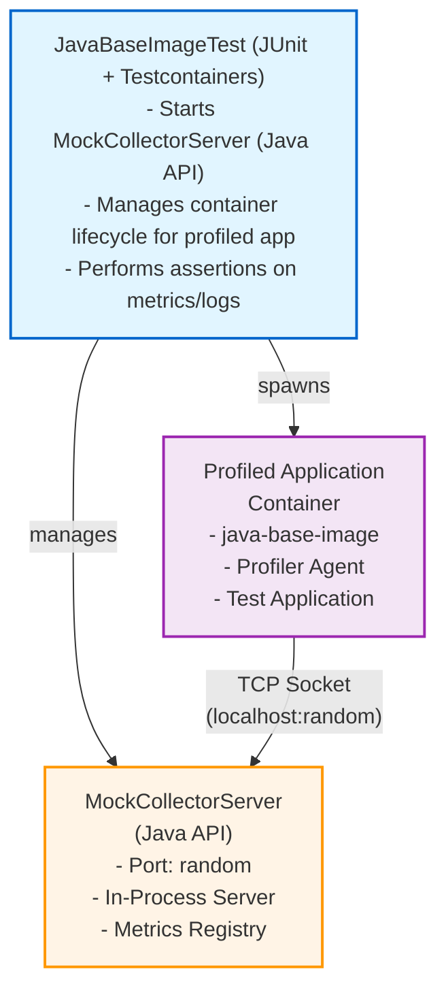

# Mock Collector Integration with Tests

This document describes how the mock-collector module is integrated with the profiler agent integration tests.

## Architecture

The integration test setup uses a Java-based mock collector server that runs in the same JVM as the tests:



## Components

### 1. MockCollectorServer Java API

The `MockCollectorServer` class provides a programmatic API for running a mock collector:

**Core API:**
```java
MockCollectorServer server = new MockCollectorServer(
    1715,  // port (default: ProtocolConst.PLAIN_SOCKET_PORT)
    50     // backlog (default: ProtocolConst.PLAIN_SOCKET_BACKLOG)
);

// Start the server asynchronously
server.start();

// Start and wait for server to be ready
server.started(Duration.ofSeconds(5));

// Get the actual port (useful if using port 0 for random port)
int actualPort = server.port;

// Access metrics
MeterRegistry metrics = server.metricRegistry;
Counter connections = server.mockConnections;

// Clean shutdown
server.close();
```

**Key Features:**
- Implements `AutoCloseable` for try-with-resources support
- Provides Micrometer metrics registry for monitoring
- Thread-safe connection handling with executor service
- Supports graceful shutdown with connection cleanup
- Logs all received profiling data (handshakes, streams, data chunks)

### 2. Integration Test (`installer/src/test/java/.../JavaBaseImageTest.java`)

Test method: `profilerSendsDataToMockCollector()`

**Setup:**
```java
// 1. Start mock collector server in-process
try (MockCollectorServer mockServer = new MockCollectorServer()) {
    mockServer.started(Duration.ofSeconds(10));

    // 2. Determine host accessible from container
    String hostForContainer = System.getProperty("os.name")
        .toLowerCase().contains("mac") ? "host.docker.internal" : "172.17.0.1";

    // 3. Start profiled app container pointing to host mock server
    try (GenericContainer<?> profilerApp = new GenericContainer<>(...)
        .withEnv("REMOTE_DUMP_HOST", hostForContainer)
        .withEnv("REMOTE_DUMP_PORT_PLAIN", String.valueOf(mockServer.port))) {

        profilerApp.start();

        // 4. Wait for data transmission
        Thread.sleep(2000);

        // 5. Check metrics
        double connectionCount = mockServer.mockConnections.count();
        // Additional assertions...
    }
}
```

**Assertions:**
- Profiler agent is enabled (check `-javaagent:` in logs)
- Mock collector receives connection (check metrics counter)
- Data is transmitted successfully

## Build Integration

### Dependencies

In `installer/build.gradle.kts`:

```kotlin
dependencies {
    testImplementation(project(":mock-collector"))
}

tasks.test {
    dependsOn(buildBaseImage, testAppJar)
}
```

This ensures:
1. Mock collector module is available on test classpath
2. Java base image with profiler agent is built
3. Test application JAR is created

## Running the Tests

### Run all installer tests
```bash
./gradlew :installer:test
```

### Run only the integration test
```bash
./gradlew :installer:test --tests "JavaBaseImageTest.profilerSendsDataToMockCollector"
```

### Run with verbose logging
```bash
./gradlew :installer:test --info
```

## Test Flow

1. **Test Initialization**
   - Gradle builds Java base image with profiler agent
   - JUnit test starts `MockCollectorServer` in-process

2. **Mock Server Startup**
   - Server binds to port 1715 (or random port if 0 specified)
   - Starts listening for connections on localhost
   - Waits for startup using `started(Duration)` method

3. **Profiled App Startup**
   - Testcontainer starts with profiler agent
   - Environment variables point to host machine (via `host.docker.internal` on Mac or bridge IP on Linux)
   - Profiler agent connects to host machine on port 1715

4. **Data Flow**
   - Profiler agent sends handshake
   - Mock collector accepts connection and increments metrics counter
   - Streams are initialized (trace, calls, etc.)
   - Profiler sends data chunks
   - Mock collector logs received data and updates metrics

5. **Verification**
   - Test waits for data transmission (typically 2 seconds)
   - Queries mock collector metrics registry for connection count
   - Checks server logs for expected data patterns
   - Prints summary of received data

6. **Cleanup**
   - Try-with-resources automatically closes `MockCollectorServer`
   - Server gracefully shuts down all active connections
   - Executor service is terminated
   - Testcontainer stops profiled app

## Log Output Example

When the test runs, you'll see logs like:

```none
MockCollectorServer - Mock Collector Server started on port 1715
MockCollectorServer - Waiting for connections from Dumper clients...
MockCollectorServer - New connection from 172.17.0.1:54321
ClientConnectionHandler - Client handshake: pod=pod_12345, microservice=testapp, namespace=default
ClientConnectionHandler - Initializing stream: name=trace, rollingSeqId=0
ClientConnectionHandler - Stream initialized: trace -> a1b2c3d4-...
ClientConnectionHandler - Data Chunk Received #1
ClientConnectionHandler -   Stream: trace
ClientConnectionHandler -   Size: 2048 bytes

[profilerApp] -javaagent:/opt/qubership/profiler/profiler.jar
[profilerApp] Hello World!

=== Mock Collector Summary ===
Connection count: 1.0
Server port: 1715
Server state: RUNNING
==============================
```

## Troubleshooting

### Port Already in Use

**Problem**: `java.net.BindException: Address already in use`

**Solutions**:
- Use port 0 to let the OS assign a random available port:
  ```java
  MockCollectorServer server = new MockCollectorServer(0, 50);
  server.start();
  int actualPort = server.port;  // Get the assigned port
  ```
- Check if another test or process is using port 1715
- Ensure previous test properly closed the server

### Connection Timeout

**Problem**: Test fails with timeout waiting for connection

**Solutions**:
- Verify the host address is correct (`host.docker.internal` on Mac, bridge IP on Linux)
- Check firewall isn't blocking the port
- Ensure mock collector server started successfully (check `server.port` doesn't throw)
- Verify container's `REMOTE_DUMP_HOST` environment variable is set correctly

### No Data Received

**Problem**: Mock collector doesn't receive data

**Solutions**:
- Increase sleep time in test (currently 2 seconds)
- Check profiled app environment variables (`REMOTE_DUMP_HOST`, `REMOTE_DUMP_PORT_PLAIN`)
- Verify profiler agent is enabled (check logs for `-javaagent:`)
- Check connection count metric: `mockServer.mockConnections.count()`
- Review mock collector logs for connection errors

### Test Fails in CI/CD

**Problem**: Test passes locally but fails in CI

**Solutions**:
- Use `0.0.0.0` or detect the correct bridge IP for Linux CI environments
- Check CI has sufficient memory
- Increase timeout durations for server startup and data transmission
- Enable debug logging: `--info` or `--debug`
- Ensure Docker is available in CI environment

## Advanced Configuration

### Custom Collector Port

To use a different or random port:

```java
// Use specific port
MockCollectorServer server = new MockCollectorServer(8080, 50);

// Use random available port
MockCollectorServer server = new MockCollectorServer(0, 50);
server.start();
int actualPort = server.port;  // Get the assigned port

// Update profiled app environment
.withEnv("REMOTE_DUMP_PORT_PLAIN", String.valueOf(actualPort))
```

### Accessing Metrics

Monitor server activity using Micrometer metrics:

```java
MockCollectorServer server = new MockCollectorServer();
server.start();

// Access the metrics registry
MeterRegistry registry = server.metricRegistry;

// Check connection count
double connectionCount = server.mockConnections.count();

// Add custom metrics as needed
registry.counter("custom.metric").increment();
```

### Network Debugging

To verify connectivity from the container to the host:

```bash
# Check if port is listening on host
netstat -an | grep 1715

# Test connection from within container
docker exec <container-id> telnet host.docker.internal 1715

# Check what address the server is bound to
# (Server logs will show the port on startup)
```

## Future Enhancements

Potential improvements:

- [ ] Add SSL/TLS test variant
- [ ] Test with multiple simultaneous profiled apps
- [ ] Verify specific protocol commands in logs
- [ ] Add performance benchmarks
- [ ] Test stream rotation scenarios
- [ ] Add negative tests (connection failures, etc.)
